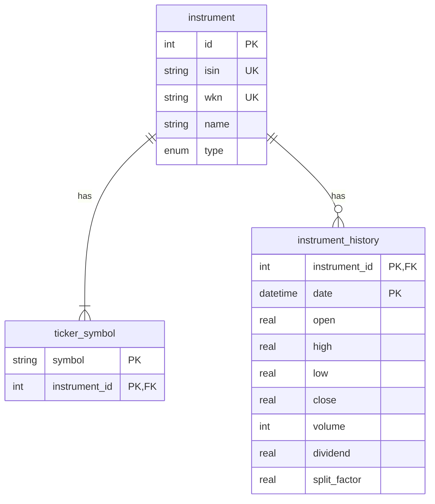
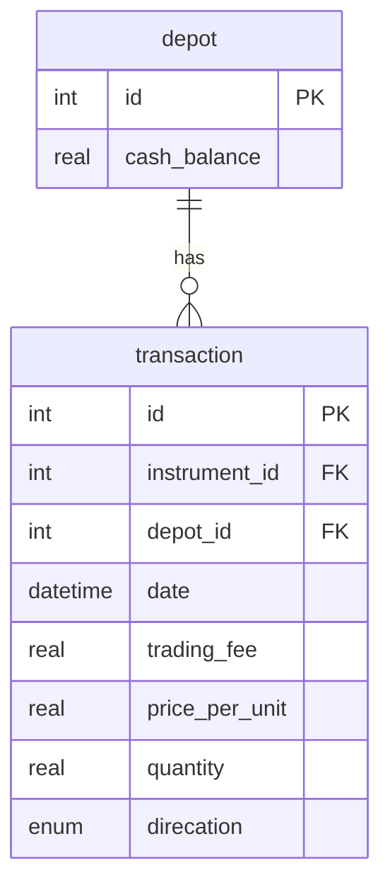

# Database

## Market Data

```mermaid
erDiagram
    instrument ||--|{ ticker_symbol : "has"
    instrument ||--o{ instrument_history : "has"
    instrument {
        int id PK
        string isin UK
        string wkn UK
        string name
        enum type
    }
    ticker_symbol {
        string symbol PK
        int instrument_id PK,FK
    }
    instrument_history {
        int instrument_id PK,FK
        datetime date PK
        real open
        real high
        real low
        real close
        int volume
        real dividend
        real split_factor
    }
```

## Depot Data

```mermaid
erDiagram
    depot ||--o{ transaction : "has"
    depot {
        int id PK
        real cash_balance
    }
    transaction {
        int id PK
        int instrument_id FK
        int depot_id FK
        datetime date
        real trading_fee
        real price_per_unit
        real quantity
        enum direcation
    }
```
