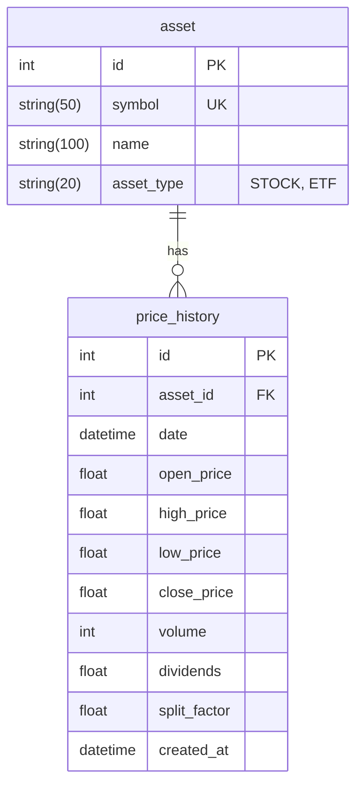
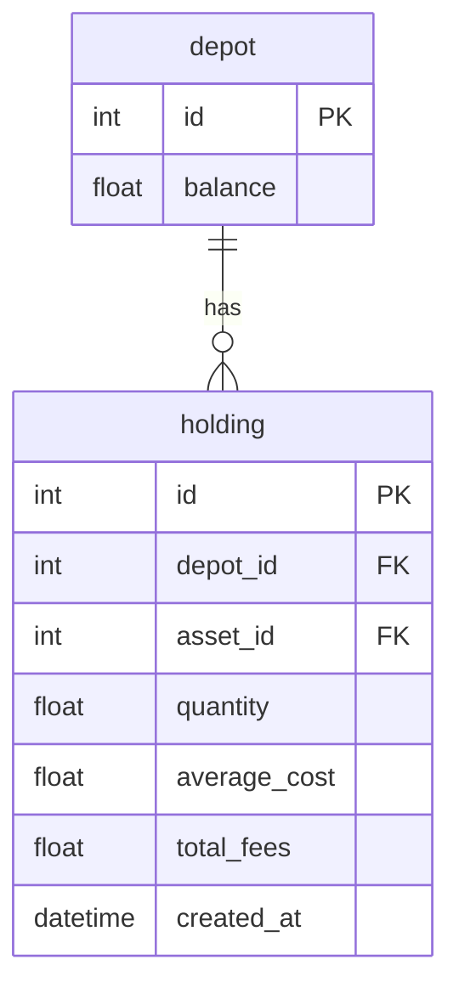
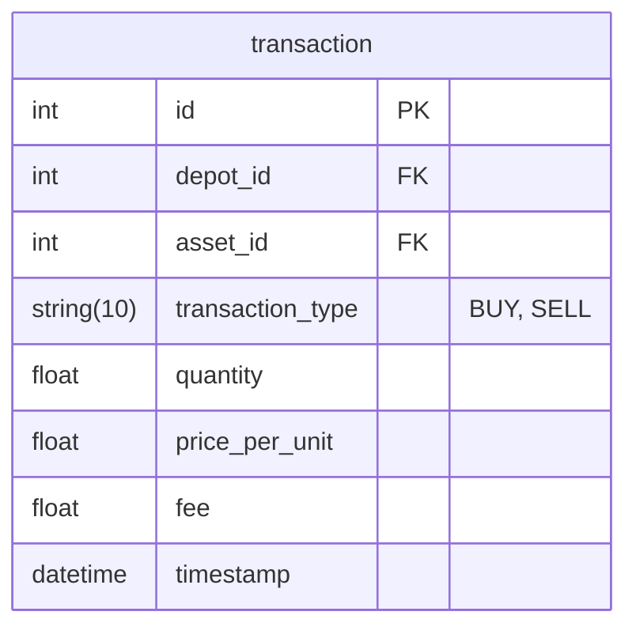

# Persistence

The database access is managed by ORM tool [SQLAlchemy](https://www.sqlalchemy.org/). The application uses SQLite as
database. The database itself will be created in the `src` folder as `depot.db` when the application is executed.

The database schema is divided into three parts: Asset, Depot, and Transactions. Their corresponding classes are all
stored in the file `models.py`.

## Assets

Whenever the user searches for an asset, the asset is stored in the database (if it exists). The asset is identified by
its ticker symbol (e.g. `MSFT` or `AAPL`). The type can be either `STOCK` or `ETF`. Together with the asset its
historical price data is stored.

As app grows, it could be considered to add ISIN/WKN to the asset table.

## Depots

The depot is the main entity of the application. It holds the cash balance and the assets the user owns. The user can
have multiple depots. The depot is identified by its ID. The holding table stores the assets the user owns in the depot.
It is optimized for fast read access.

## Transactions

The transaction table stores all transactions the user has made. It is optimized for fast write access and to analyze
historical data.

